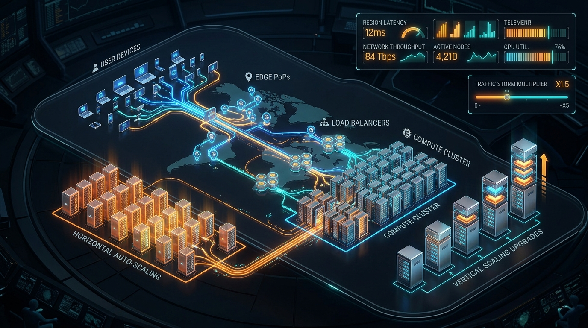

# ⚡ Hyperscaler

<p align="center">
  <strong>Holographic Cloud Architecture & Auto-Scaling Simulator</strong><br>
  <em>Interactive 60 FPS Canvas visualization of Queuing Theory, Little's Law, Edge CDN Caching, and Chaos Engineering</em>
</p>

<p align="center">
  
  
  
  
  
  
  
  
</p>

---



---

## 🌟 Overview

**Hyperscaler** is an interactive, visual-first cloud infrastructure simulator engineered to demystify complex distributed systems concepts through real-time cybernetic visuals. 

Experience the tangible differences between **Horizontal Auto-Scaling** and **Vertical Scaling Upgrades** under traffic surges up to 125,000+ requests/sec, complete with edge caching deflection, load balancing distribution, real-world multi-cloud cost modeling, and chaos monkey resilience.

- **100% Client-Side**: Zero backend servers required. Runs pure queuing theory, deterministic state transitions, and high-performance particle physics directly in the browser at 60 FPS.
- **☁️ Multi-Cloud Cost Modeling**: Real-time operational cost calculator for **AWS**, **GCP**, and **Azure** based on live 2026 pricing, calculating compute, CDN egress, load balancer fees, hourly burn rate, and edge cache savings.
- **📱 Fully Responsive & Touch-First**: Native thumb-zone floating action dock, slide-up bottom drawer, and direct touch inspection for server pods on mobile screens.
- **Instant GitHub Pages Deployment**: Fully configured for static export (`output: 'export'`) with an automated GitHub Actions CI/CD pipeline.
- **Strict Supply Chain Security**: Enforces pnpm package age policy (`minimumReleaseAge: 2880`).
- **Comprehensive Unit Testing**: 25 automated tests running natively in ~120ms via Node 22 (`node:test`).

---

## 🕹️ Interactive Features

| Feature | Description | Visual Effect |
| :--- | :--- | :--- |
| **⚡ Traffic Storm Multiplier** | Real-time traffic volume scaling from **0.2x (~5k req/s)** to **5.0x (125k+ req/s)**. | Calibrated packet pool ($6 \to 142$), particle velocity scales with glowing motion blur trails, and conduit electric pulses accelerate smoothly. |
| **☁️ Multi-Cloud Cost Model** | Real-world cost breakdown comparing **AWS**, **GCP**, and **Azure** with instant provider switching. | Live estimated monthly total, hourly burn rate, cost per 1M requests, and glowing green edge cache savings callout ($-\$X,XXX$/mo). |
| **🔄 Horizontal Auto-Scaling** | Dynamic pod replication scaling from **8 to 28 pods** based on ingress load. | Real-time server blade racks with green/amber/red CPU load bars and flashing activity LEDs. |
| **🏢 Vertical Scaling Upgrades** | Modular core tier scaling across 4 monolithic towers (**8C, 16C, 32C, 64C**). | Stacking physical hardware core levels, upward ascension indicators, and pulsing thermal plasma lattices. |
| **🛡️ Edge CDN Cache Ratio** | Configurable edge cache hit rate from **0% to 98%**. | Cache hits deflect cyan packets back to users within 5ms; misses route amber packets downstream to load balancers. |
| **🐒 Chaos Monkey** | Simulates instant cloud zone outages and infrastructure degradation. | Pods glow red with overload warnings, latency jumps to 340ms, and an automated 4.5s self-healing wave restores health. |
| **📱 Mobile Action Dock & Sheet** | Ergonomic bottom thumb dock with expandable cybernetic glass drawer. | Full-screen canvas on mobile devices, with instant touch access to controls, live telemetry, and cloud cost breakdowns. |
| **🔍 Real-Time Node Inspector** | Click or tap any server blade or tower on the canvas. | Opens a HUD modal detailing core counts, RAM allocations, CPU utilization, and requests/sec. |

---

## 📐 Queuing Theory & Simulation Mathematics

The simulation runs on deterministic mathematical formulas implemented in [`src/lib/simulation/physics.ts`](src/lib/simulation/physics.ts):

### 1. Edge Cache Offloading
$$\lambda_{\text{absorbed}} = \lambda_{\text{traffic}} \times H_{\text{cache}}$$
$$\lambda_{\text{origin}} = \lambda_{\text{traffic}} - \lambda_{\text{absorbed}}$$

### 2. Capacity & Little's Law Utilization
- **Horizontal Capacity**: $C_{\text{total}} = N_{\text{pods}} \times 3{,}000\text{ req/s}$
- **Vertical Capacity**: $C_{\text{total}} = 4 \times N_{\text{cores}} \times 850\text{ req/s}$
- **Load Ratio**: $\rho = \frac{\lambda_{\text{origin}}}{C_{\text{total}}}$

### 3. Latency & Degradation Curves
When utilization $\rho$ exceeds 85%, the system degrades gracefully following queuing backpressure:
- $P_{50} = 10\text{ms} + 2 \times \Delta_{\text{excess}}$
- $P_{95} = 20\text{ms} + 5 \times \Delta_{\text{excess}}$
- $P_{99} = 32\text{ms} + 12 \times \Delta_{\text{excess}}$
- Error Rate % $= \min(15\%,\, 0.3 \times \Delta_{\text{excess}})$

### 4. Calibrated Particle Flow
$$N_{\text{particles}} = \operatorname{round}\left(6 + (\text{mult} - 0.2) \times 28.33\right)$$
- At **0.2x traffic (Idle)**: 6 packets (whisper-quiet conduit tracing).
- At **1.0x traffic (Normal)**: 22 packets (rhythmic, calm pulse along neon conduits).
- At **2.5x traffic (Viral)**: 67 packets (accelerated multi-stream flow).
- At **5.0x traffic (Storm)**: 142 packets (high-intensity surge with velocity blur).

### 5. Multi-Cloud Cost Modeling (AWS, GCP, Azure)
Operational expenditure is evaluated continuously against live cloud pricing models:
- **Total Monthly Cost**: $C_{\text{monthly}} = C_{\text{compute}} + C_{\text{CDN}} + C_{\text{LB}}$
- **Hourly Burn Rate**: $R_{\text{burn}} = \frac{C_{\text{monthly}}}{732\text{ hours}}$
- **Unit Economics**: $\text{Cost per 1M Reqs} = \frac{C_{\text{monthly}}}{(\lambda_{\text{traffic}} \times 2{,}635{,}200) / 10^{6}}$
- **Edge CDN Savings**: $S_{\text{edge}} = C_{\text{baseline (direct egress)}} - C_{\text{monthly}}$

---

## 🏛️ Project Architecture

```
hyperscaler/
├── .github/workflows/
│   └── deploy.yml               # Automated GitHub Pages CI/CD workflow
├── public/
│   ├── .nojekyll                # Disables Jekyll processing for Next.js assets
│   ├── preview.jpg              # High-resolution UI banner
│   └── robots.txt
├── src/
│   ├── app/
│   │   ├── layout.tsx           # Dark cybernetic root layout & OpenGraph metadata
│   │   ├── page.tsx             # Main dashboard layout
│   │   ├── globals.css          # Cyberpunk neon gradients & HUD animations
│   │   └── icon.svg             # Glowing neon vector favicon
│   ├── components/
│   │   ├── HolographicCanvas.tsx # 60 FPS Canvas coordinator (195 lines)
│   │   ├── TelemetryHUD.tsx     # Responsive metrics readout (P50/P99 latency, RPS, CPU)
│   │   ├── CloudCostHUD.tsx     # Multi-cloud cost engine HUD with 3-way provider switch
│   │   ├── MobileDrawer.tsx     # Ergonomic mobile thumb dock & slide-up drawer
│   │   ├── TrafficStormSlider.tsx # Multiplier controller (0.2x - 5.0x)
│   │   ├── ScalingControl.tsx   # Architecture mode toggle (Horizontal vs Vertical)
│   │   ├── CdnSlider.tsx        # Edge CDN cache ratio slider (0% - 98%)
│   │   ├── ChaosControl.tsx     # Chaos monkey outage trigger
│   │   └── NodeInspectorModal.tsx # Live node telemetry modal
│   ├── hooks/
│   │   └── useSimulationStream.ts # Reactive hook bridging state to engine (99 lines)
│   └── lib/
│       ├── simulation/          # Pure mathematical simulation library
│       │   ├── types.ts         # ClusterState, ServerNode, SimulationLayout
│       │   ├── physics.ts       # Pure Little's Law, queuing, & particle formulas
│       │   ├── cloudCosts.ts    # Multi-cloud operational cost modeling engine
│       │   ├── engine.ts        # Deterministic simulation state machine
│       │   └── layout.ts        # Responsive topology coordinate geometry
│       └── canvas/renderers/    # Modular 2D Canvas rendering layers
│           ├── tableRenderer.ts # Tabletop platform & perspective grid
│           ├── conduitRenderer.ts # Pulsing electric current lines
│           ├── clientRenderer.ts # User swarm emitter with traffic volume
│           ├── cdnRenderer.ts   # Edge PoP radar deflection waves
│           ├── lbRenderer.ts    # Load balancer spinning RPM arcs
│           ├── stageRenderer.ts # Compute stage frame & HUD title
│           ├── horizontalClusterRenderer.ts # Server blades with live LED bars
│           ├── verticalTowerRenderer.ts     # Core tier monoliths & plasma
│           ├── particleRenderer.ts          # Particle lifecycle & motion blur
│           └── index.ts         # Single re-export entrypoint
├── tests/
│   ├── cloudCosts.test.ts       # 5 tests: AWS/GCP/Azure pricing, caching savings, tiers
│   ├── physics.test.ts          # 8 tests: traffic, queuing, particle velocity
│   ├── engine.test.ts           # 7 tests: pod replication, core tiers, chaos
│   ├── layout.test.ts           # 5 tests: geometry, mobile bounds, collision clearance
│   ├── loader.mjs               # Node 22 ESM test loader registration
│   └── resolver-hook.mjs        # Extensionless TypeScript import resolver
├── Dockerfile                   # Multi-stage lightweight Nginx static container
├── docker-compose.yml           # Single-command Docker deployment
├── next.config.ts               # Static HTML export & automatic basePath resolution
├── package.json                 # Type module & test scripts
├── pnpm-workspace.yaml          # 2-day package age security policy
└── start.sh                     # Quick launcher (local dev or Docker)
```

---

## 🚀 Getting Started

### Prerequisites
- **Node.js**: `v20.0.0` or higher (Node 22 recommended)
- **pnpm**: `v9.0.0` or higher

### 1. Local Development
```bash
git clone https://github.com/<your-username>/hyperscaler.git
cd hyperscaler
pnpm install
pnpm dev
```
Open [http://localhost:3000](http://localhost:3000) in your browser.

### 2. Run Automated Tests
```bash
npm test
# or directly with Node 22:
node --test --experimental-strip-types --import ./tests/loader.mjs tests/*.test.ts
```
All 25 unit tests run in **~120ms** with zero external testing dependencies.

### 3. Production Static Build
```bash
pnpm build
```
Generates a static production bundle in `out/`, ready for any static web host.

### 4. Docker Deployment
```bash
./start.sh
# or
docker compose up --build -d
```
Access the simulator at [http://localhost:3000](http://localhost:3000).

### 5. Docker Cleanup & Purge
```bash
./delete.sh
```
Stops containers and removes all associated images, volumes, and dangling build cache.

---

## 🌐 Deploying to GitHub Pages (1-Click)

1. **Create a GitHub repository** and push the code:
   ```bash
   git init
   git add .
   git commit -m "feat: initial release of Hyperscaler"
   git remote add origin https://github.com/<your-username>/<repo-name>.git
   git branch -M main
   git push -u origin main
   ```

2. **Enable GitHub Pages**:
   - In your repository, go to **Settings** → **Pages**.
   - Under **Build and deployment** → **Source**, choose **GitHub Actions**.

3. **Automatic Deployment**:
   - Every push to `main` automatically runs tests, compiles the static export, and deploys to `https://<your-username>.github.io/<repo-name>/`.
   - The included [`next.config.ts`](next.config.ts) automatically detects the repository name and configures `basePath` accordingly.

---

## 🛠️ Tech Stack

- **Framework**: Next.js 16 (App Router, Static Export)
- **UI Library**: React 19
- **Graphics**: HTML5 2D Canvas with Hardware-Accelerated 60 FPS Particle Engine
- **Styling**: Tailwind CSS 3.4
- **Icons**: Lucide React
- **Testing**: Node 22 Native Test Runner (`node:test`, `node:assert/strict`)
- **Package Manager**: pnpm 11 with age policy guardrails

---

## 🤝 Contributing

Contributions, issues, and feature requests are welcome! Check out our [Contributing Guidelines](CONTRIBUTING.md) to get started.

---

## 📄 License

This project is open source and available under the [MIT License](LICENSE).
